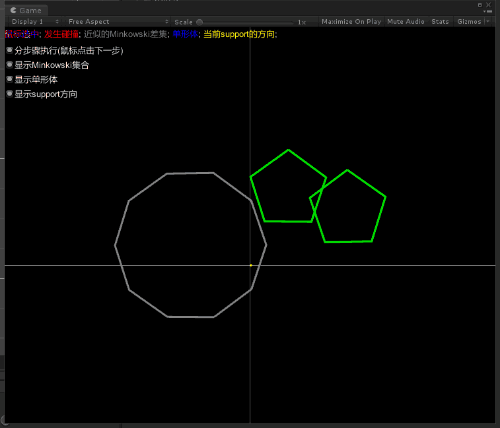
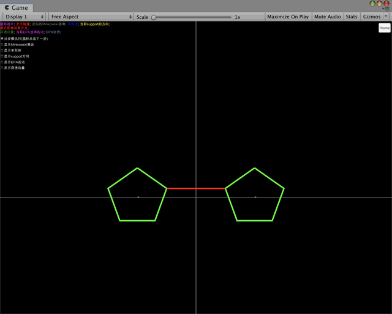
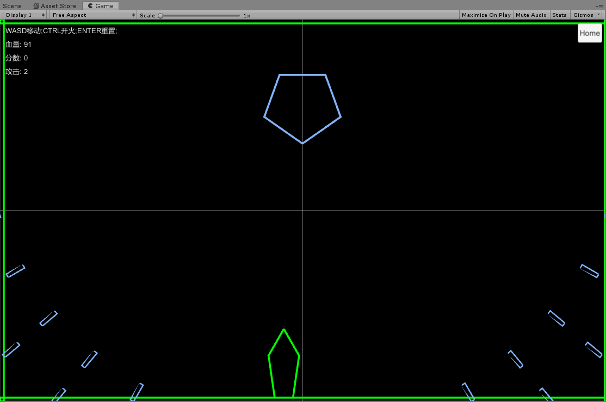

物理引擎学习
====================
又挖了个坑，有时间慢慢填吧。目录暂且如此，后面随着内容的丰富，可能会有一些变动。

详细文章内容，可以看我的博客: https://blog.csdn.net/you_lan_hai/article/details/108305631

章节的目录被我统一移入了Assets/目录中。

# 第一部分 基础碰撞检测
## 1 基础内容
## 2 [分离碰撞轴检测](Assets/02-sat)
## 3 [GJK碰撞检测基础](Assets/03-gjk/README.md)
## 4 [GJK计算最近距离](Assets/04-gjk-closest-point/README.md)
## 5 [GJK计算穿透向量(EPA)](Assets/05-gjk-epa/README.md)
## 6 [碰撞分离](Assets/06-seperation)
## 7 [Demo小游戏飞机大战](Assets/07-2d-demo)

# 第二部分 空间划分
## 8 [AABB树空间划分]((Assets/08-aabb-tree))
## 9 二叉树空间划分(BSP)
## 10 基于网格的空间划分

# 第三部分 3D碰撞检测
## 11 基础内容
## 12 GJK算法扩展到3D空间
## 13 AABB树空间划分
## 14 二叉树空间划分(BSP)
## 15 基于网格的空间划分

